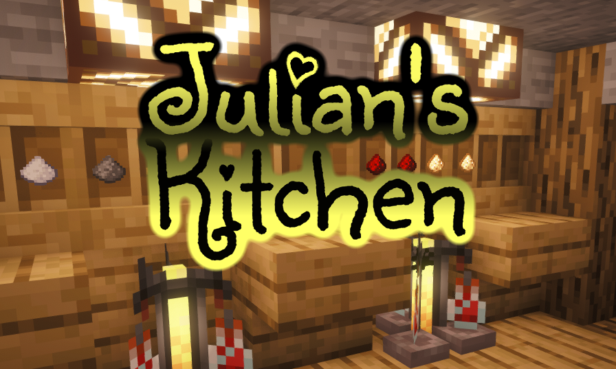
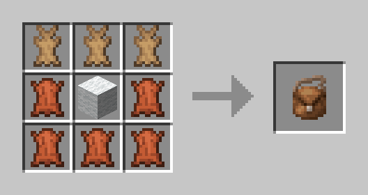

You think the brewing in Minecraft is cool but could use a tad more complexity? Me too!  

This mod expands the potion brewing system in Minecraft by adding more upgrades to existing potions, new potions to previously inaccessible vanilla effects and some entirely new effects along with potions for these effects. All while attempting to keep a somewhat vanilla feel to it.
Also: Potion Bundle!

---

## Content

1. [What This Mod Does](#what-this-mod-does)

2. [Installation & Requirements](#installation--requirements)

3. [All Recipes](#all-recipes)

4. [Potential Future Additions](#potential-future-additions)

---

## What This Mod Does

- Adds the possibility to stack time effects (from Redstone Dust) with amplification effects (from Glowstone Dust). Any potion can now receive up to two Redstone and two Glowstone Dust, raising both effect duration and effect amplifier up to two times.  This also includes Splash Potions, Lingering Potions and Tipped Arrows.
    - Exceptions are:
        - Instant effects do not have Redstone based derivatives because they have no duration.
        - Water Breathing, Invisibility, Night Vision, Slow Falling and Fire Resistance do not have Glowstone based derivatives.
        - Oozing, Infestation, Weaving, Wind Charged as well as the Turtle Master branch have no new derivatives (for now).
        
- Adds Potions for Vanilla Effects that weren’t obtainable through potions before:
    - Haste (Awkward Potion + Sweet Berries)
    - Resistance (Awkward Potion + Apple)
    - Health Boost (Awkward Potion + Honey Bottle)
    - Saturation (Awkward Potion + Any Mushroom: Brown Mushroom/Red Mushroom/Warped Fungus/Crimson Fungus)
    - Glowing (Awkward Potion + Glow Berries)
    - Levitation (Awkward Potion + Eye of Ender)
    - Luck (Awkward Potion + Ender Pearl)
    
- Adds new Effects along with potions:
    - Immune
        - Awkward Potion + Poisonous Potato
        - Protects the affected from receiving any harmful effects like poison or slowness. Previously received harmful effects are also canceled.
    - Cold Feet
        - Awkward Potion + Powder Snow Bucket
        - Makes the affected freeze water under their feet, similar to the frost walker enchantment.
    - Soft Landing
        - Awkward Potion + Any Wool
        -  Negates all fall damage for the affected.
    - Mending Touch
        - Awkward Potion + Resin Clump
        - Makes the affected repair any tool slowly over time by holding it in their main hand while the effect is active.
        
- Adds Potion Bundle item
    - Works similar to the Bundle item but can only hold potions and bottles.
    - Holds up to 6 bottles. 
        - (Can be changed via `julianskitchen:potion_bundle_capacity` gamerule)
        - One bottle can be a water bottle, a potion, an empty glass bottle or a honey bottle.
    - Only displays one topmost item in tooltip. 
        - (Can be changed via `julianskitchen:potion_bundle_visible_count` gamerule) 
    - Can be crafted using 3 rabbit hide, 5 leather and one wool block of any color.
        - 
        - Can be dyed any color by combining the Potion Bundle with a dye in crafting. **BE CAREFUL: Dying a Potion Bundle removes its content. This will get fixed in the future.**
---

## Installation & Requirements

This mod requires the Fabric Loader as well as the Fabric API mod to function.

**Installation Steps:**

1. Download and install Fabric Loader into your launcher. You can get it here: https://fabricmc.net/
2. Set your installation inside the Minecraft Launcher to launch the installed Fabric Loader version. 
3. Get the **Fabric API Mod .jar** for your Minecraft version from here: https://www.curseforge.com/minecraft/mc-mods/fabric-api/files/all
4. Get the **Julian’s Kitchen Mod .jar** for your Minecraft version from here: https://www.curseforge.com/minecraft/mc-mods/julianskitchen/files/all
5. Place **both downloaded .jar files** (Fabric API & Julian's Kitchen) inside %appdata%/.minecraft/mods/
6. Get Cooking. We must cook Jesse!

---

## All Recipes

This table shows all brewing recipes (Vanilla & Mod). 

Potions that are available in vanilla have a blue background.

Full size image: https://juhewe.de/jkrecipes.webp

---

## Potential Future Additions

- Ability to combine certain ingredients into multi-effect potions.
- Better balancing of effect times and amplifiers.
- More enchantment effects as potion effects.
- A potion that changes the weather
